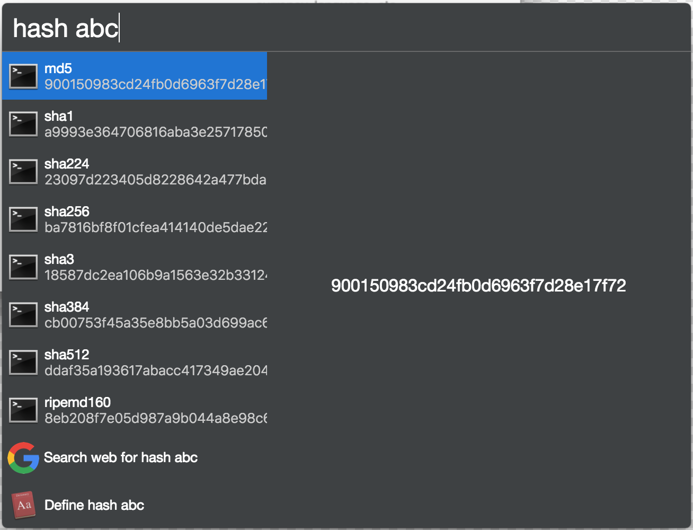

# cerebro-hash

> [Cerebro](https://cerebroapp.com) plugin to hash text input

## Usage

In Cerebro, type algorithm and input, use the up/down keys to select result, and press `enter` or `⌘ + c` to copy it to clipboard.

* `hash [input]`
* `hash (algorithm) [input]`
* `(algorithm) [input]`

Ex: `md5 lorem ipsum`

  => `80a751fde577028640c419000e33eba6`

#### Supported Algorithms:

* `hash` - list hash input with _all_ algorithms
* `md5`
* `sha1`
* `sha224`
* `sha256`
* `sha3`
* `sha384`
* `sha512`
* `ripemd160`

## Installing

* Type `plugins hash` into Cerebro
* Click `install`

## Motivation

This plugin was inspired by the similar Alfred Workflow. (Solutions may be different, because that workflow removes whitespace..)
My real motivation for this was just to play around with creating a plugin for Cerebro.
The next thing I want to accomplish in this plugin is to be able to pass a file path and get the hash for that file.

## Related

- [Cerebro](http://github.com/KELiON/cerebro) – main repo for Cerebro app;

## License

MIT © [Matthew Jacobs](https://www.mattjdev.com)
